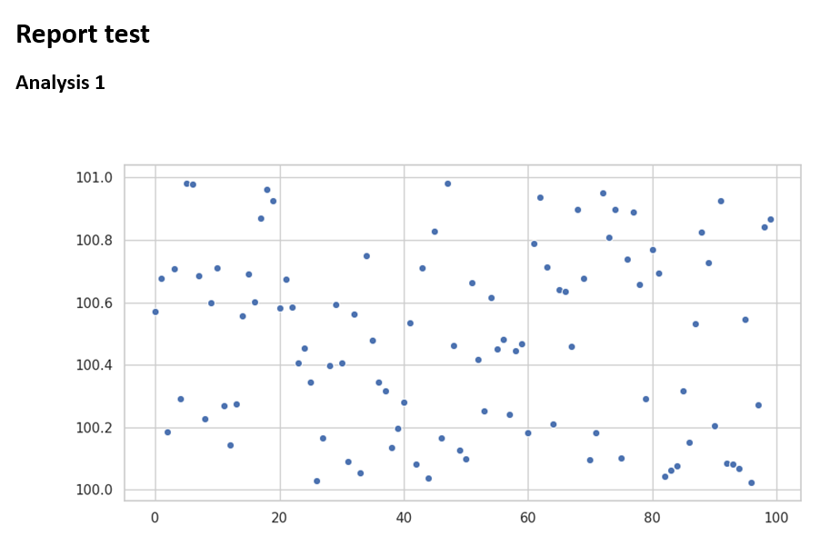

# aws-ses-lambda-python-report

This sample demonstrates how to to send a scheduled email report using Python 3.7, AWS Lambda, and SES services.

## Introduction

Working with python notebooks on data science tasks is very cool, but it is not easy to automate the execution of the analysis and notify the results as it is shown with the following image



There are some interesting works that automate the sending throw Jupyter such as

* <https://pbpython.com/papermil-rclone-report-1.html>
* <https://medium.com/capital-fund-management/automated-reports-with-jupyter-notebooks-using-jupytext-and-papermill-619e60c37330>

but the solution proposed is much easier, minimal, and easy to maintain throw AWS lambda. The main idea is to close the analysis into python functions that can be shared between the notebook and the reporting lambda as in the following example

```python
def analysis1():
    """Analyse data."""
    graph = io.BytesIO()
    f, _ = plt.subplots(figsize=(10, 5))
    sns.set_color_codes("pastel")
    sns.scatterplot(range(0, 100), np.random.random_sample(100) + 100)
    f.savefig(graph, format='png')
    return base64.b64encode(graph.getvalue()).decode('UTF-8')
```

and encode the result into a base64 image to avoid the usage the read-only filesystem of AWS lambda. Then the encoded string can be embedded into a simple html report.

## Pre-requisites

* Python 3.7
* Node.js 10.x
* A AWS account with the SES (Simple Email Service) configured, i.e. the email addresses must be verified

## Getting Started

Build from the commandline using

```bash
npm i -g serverless
npm i
pipenv install
```

and deploy using

```bash
sls deploy
```

Please, remember to create and compile the `.env` file with the following variables

```python
SENDER=sender@email
RECIPIENT=recipient@email
AWS_REGION=aws_region
SUBJECT=email_subject
CHARSET=UTF-8
```

that must be set also into  `serverless.yml`  for the deployment.

## Support

If you've found an error in this sample, please file an issue:
<https://github.com/dtosato/aws-ses-lambda-python-report/issues>

Patches are encouraged, and may be submitted by forking this project and
submitting a pull request through GitHub.
